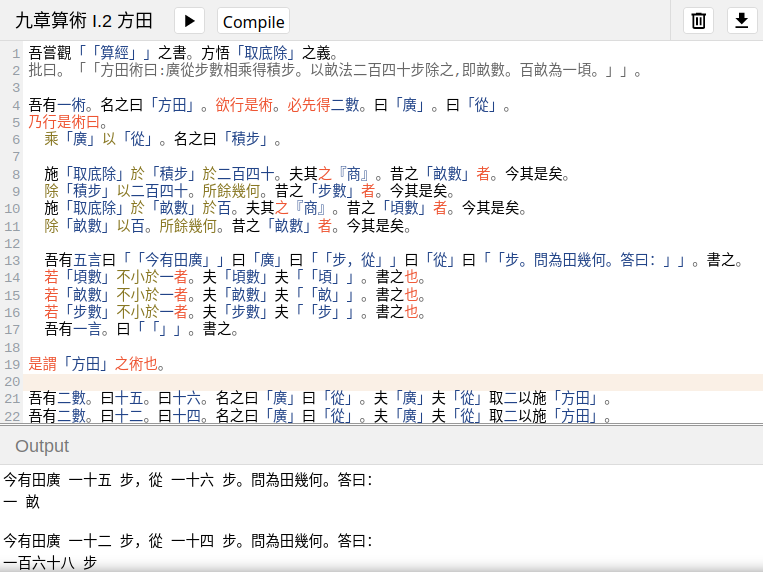

# NineChapters

This projet includes programs related to the _Nine Chapters_ (九章算術
_Jiuzhang Suanshu_), the ancient Chinese classic of mathematics.

See Karine CHEMLA and GUO Shuchun, _Les Neuf Chapitres. Le classique
mathématique de la Chine ancienne et ses commentaires_, Paris, France,
Dunod, 2005, xvi+1117 p.

These programs are written in [Wenyan programming
language](https://archive.softwareheritage.org/browse/origin/directory/?origin_url=https://github.com/wenyan-lang/wenyan).


## Example

```wenyan
吾嘗觀「「算經」」之書。方悟「取底除」之義。
批曰。「「方田術曰:廣從步數相乘得積步。以畝法二百四十步除之,即畝數。百畝為一頃。」」。

吾有一術。名之曰「方田」。欲行是術。必先得二數。曰「廣」。曰「從」。
乃行是術曰。
  乘「廣」以「從」。名之曰「積步」。

  施「取底除」於「積步」於二百四十。夫其之『商』。昔之「畝數」者。今其是矣。
    除「積步」以二百四十。所餘幾何。昔之「步數」者。今其是矣。
    施「取底除」於「畝數」於百。夫其之『商』。昔之「頃數」者。今其是矣。
    除「畝數」以百。所餘幾何。昔之「畝數」者。今其是矣。

  吾有五言曰「「今有田廣」」曰「廣」曰「「步，從」」曰「從」曰「「步。問為田幾何。答曰：」」。書之。
  若「頃數」不小於一者。夫「頃數」夫「「頃」」。書之也。
  若「畝數」不小於一者。夫「畝數」夫「「畝」」。書之也。
  若「步數」不小於一者。夫「步數」夫「「步」」。書之也。
  吾有一言。曰「「」」。書之。

是謂「方田」之術也。

吾有二數。曰十五。曰十六。名之曰「廣」曰「從」。夫「廣」夫「從」取二以施「方田」。
吾有二數。曰十二。曰十四。名之曰「廣」曰「從」。夫「廣」夫「從」取二以施「方田」。
```

## Image

You can copy-paste, run and modify these programs in the [Wenyan
IDE](https://ide.wy-lang.org/).




## Licence

[CeCILL v2.1](./Licence_CeCILL_V2.1-en.txt)
